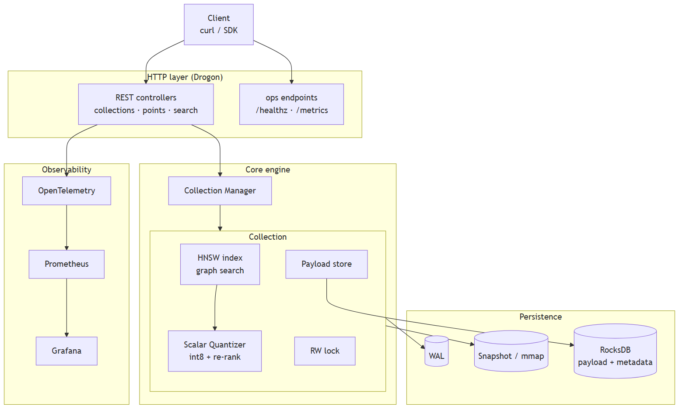
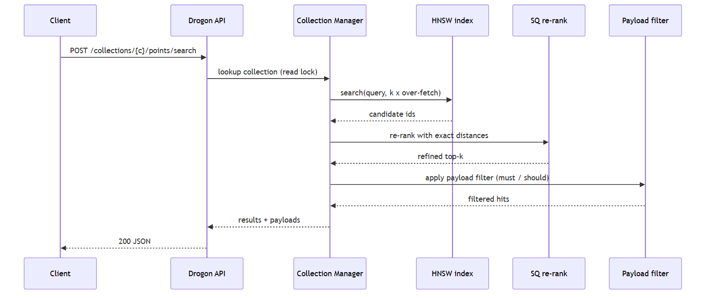
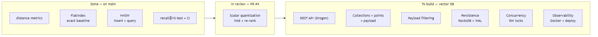

# VectorSearch - Design

A vector database built from scratch in C++: an HNSW graph index and int8 scalar
quantization at the core, wrapped as a deployable service with a REST API,
payload filtering, durable storage, and observability.

A printable version of this document is in
[VectorSearch-Design.pdf](VectorSearch-Design.pdf).

## Overview

VectorSearch stores high-dimensional vectors with attached JSON payloads and
answers "find the k most similar vectors to this query, optionally filtered by
payload" over HTTP. The ANN engine (HNSW + quantization) is written with no
third-party ANN library; the surrounding database layer turns it into a service
in the same spirit as Qdrant.

## System architecture

Requests enter through the Drogon HTTP layer. The Collection Manager owns one
index per collection; a search runs the HNSW graph, refines the shortlist with
exact distances on the quantized vectors, then applies the payload filter.
Writes go to a WAL and periodic snapshots; payloads and metadata live in
RocksDB. Every request is traced through OpenTelemetry.



## Search request flow

A search over-fetches candidates from the graph (k times an over-fetch factor),
re-ranks them with exact distances so the returned order is accurate, and only
then filters by payload. Over-fetching before filtering keeps recall high when
filters are selective.



## Data model

| Entity | Fields | Notes |
| --- | --- | --- |
| `Collection` | name, dim, metric, index params | One HNSW index + payload store, guarded by a read/write lock |
| `Point` | id (uint64), vector (f32[dim]), payload (JSON) | The unit of storage and retrieval |
| `Payload` | arbitrary key/value JSON | Used for hybrid filtering during search |
| `Neighbor` | id, distance, payload | A single search result, sorted closest first |

## REST API

| Method | Path | Purpose |
| --- | --- | --- |
| PUT | `/collections/{name}` | Create a collection (dim, metric, params) |
| GET | `/collections/{name}` | Collection info + point count |
| PUT | `/collections/{name}/points` | Upsert points (id, vector, payload) |
| POST | `/collections/{name}/points/search` | k-NN search with optional payload filter |
| DELETE | `/collections/{name}/points/{id}` | Delete a point |
| GET | `/healthz` and `/metrics` | Liveness probe and Prometheus metrics |

The contract is published as an OpenAPI spec so a typed client SDK can be
generated.

## Persistence

- **Write-ahead log (WAL)** - every upsert/delete is appended before it is
  acknowledged; replayed on startup to recover the tail.
- **Snapshots** - the index and vectors are flushed to a compact binary file
  periodically, truncating the WAL.
- **RocksDB** - payloads and collection metadata live in an embedded key/value
  store (the same engine Qdrant uses).
- **mmap** - large vector snapshots are memory-mapped so an index bigger than
  RAM still loads.

## Build status and roadmap



| Milestone | Scope | Status |
| --- | --- | --- |
| Engine | distance metrics, FlatIndex, HNSW insert + query, recall test, CI | done |
| Quantization | scalar int8 codec + exact re-rank pass | in review |
| M1 | Drogon service skeleton + `/healthz` | to build |
| M2 | collections + points + payload, core REST API | to build |
| M3 | payload filtering (hybrid search) | to build |
| M4 | persistence: RocksDB + WAL + snapshot recovery | to build |
| M5 | concurrency: per-collection RW locks | to build |
| M6 | observability + Docker + Fly.io deploy | to build |

## Tech stack

| Layer | Choice | Why |
| --- | --- | --- |
| Engine | C++17, from scratch | full control over data structures and performance |
| HTTP | Drogon (async C++) | fast, modern, one language with the engine |
| Storage | RocksDB | battle-tested embedded KV, what real databases build on |
| Observability | OpenTelemetry + Prometheus + Grafana | standard, vendor-neutral telemetry |
| Delivery | Docker + Fly.io | reproducible build, one-command edge deploy |
| Contract | OpenAPI (REST) | generated clients, clear API surface |

## Diagram sources

The diagrams are generated from the `.mmd` (Mermaid) files in this folder:

```
mmdc -i architecture.mmd -o architecture.png -b white -s 2
```
